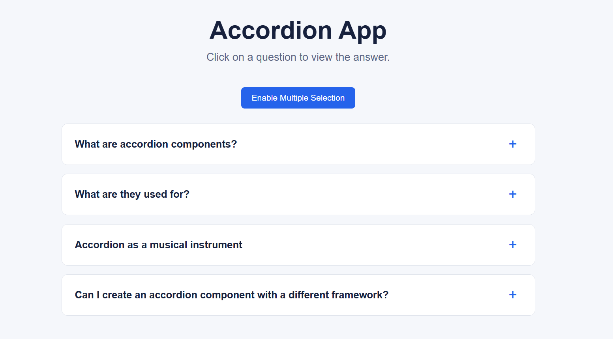
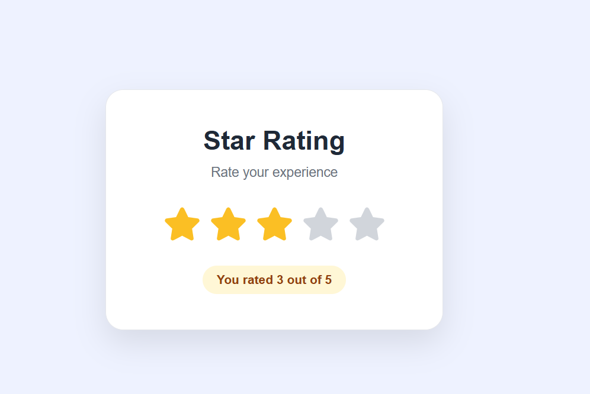
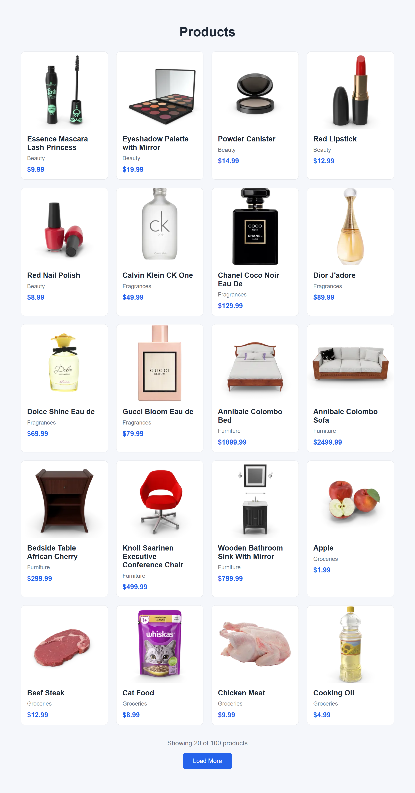
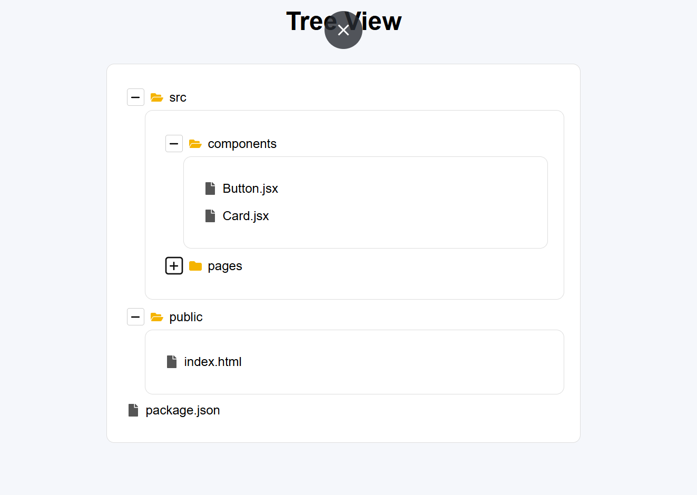
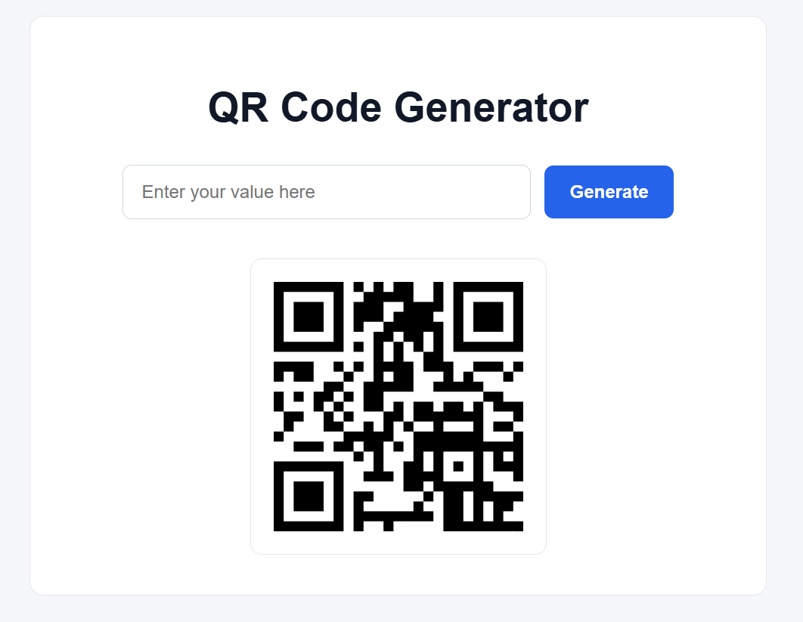
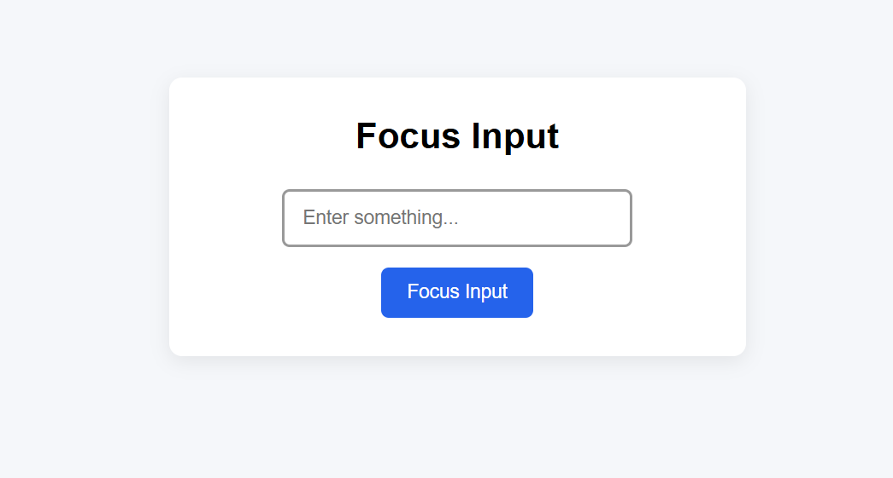

# React Hooks Project Pack

A hands-on React learning repository focused on understanding React Hooks through practical, small-scale projects.

Instead of learning React Hooks only through theory, this project pack focuses on building functional applications where React concepts are applied to real UI interactions, state management, API integration, DOM interaction, reusable components, and dynamic rendering.

## 🎯 Learning Objective

The main goal of this project pack is to strengthen practical React development skills by building multiple focused applications.

The three primary React Hooks practiced throughout this learning journey are:

- `useState`
- `useEffect`
- `useRef`

Each project focuses on a specific problem and provides practical experience with React state, side effects, events, DOM references, API data, conditional rendering, recursive components, and reusable component patterns.

---

## 🚀 Projects

| # | Project | Key Concepts | Status |
|---|---|---|---|
| 01 | [Accordion App](./accordion-app) | `useState`, Props, Conditional Rendering | ✅ Completed |
| 02 | [Star Rating](./star-rating) | `useState`, Events, Hover State | ✅ Completed |
| 03 | [Image Slider](./image-slider) | `useState`, `useEffect`, API Fetching | ✅ Completed |
| 04 | [Load More Data](./load-more-data) | `useState`, `useEffect`, API, Pagination | ✅ Completed |
| 05 | [Tree View](./tree-view) | `useState`, Props, Recursion, Nested Data | ✅ Completed |
| 06 | [QR Code Generator](./qr-code-generator) | `useState`, Controlled Input, Package Integration | ✅ Completed |
| 07 | [Focus Input App](./focus-input-app) | `useRef`, DOM Reference, Focus Interaction | ✅ Completed |

> This project pack focuses on practical React Hook learning through small, independent applications.

---

# 🧠 React Hooks Practiced

## 1. `useState`

`useState` is used throughout the project pack to manage dynamic and interactive UI state.

### Practiced in:

**Accordion App**

- Manage opened accordion items
- Handle single selection and multiple selection modes

**Star Rating**

- Store the selected rating
- Manage temporary hover state

**Image Slider**

- Track the current image
- Manage loading and error states

**Load More Data**

- Store fetched products
- Track loading and error states
- Manage the number of products displayed

**Tree View**

- Control whether folders are expanded or collapsed

**QR Code Generator**

- Store the input value
- Store the value used for QR code generation
- Update the QR code dynamically

---

## 2. `useEffect`

`useEffect` is used when the application needs to perform side effects, especially when working with external API data.

### Practiced in:

**Image Slider**

- Fetch image data from an API
- Load data when the component renders
- Handle asynchronous data

**Load More Data**

- Fetch product data from an API
- Handle asynchronous data loading
- Update the UI when new data is fetched

---

## 3. `useRef`

`useRef` is used to create a reference to a DOM element and interact with it directly.

### Practiced in:

**Focus Input App**

- Create a reference to the input element
- Access the input through `.current`
- Programmatically focus the input
- Understand practical DOM interaction with `useRef`

Example:

```jsx
const inputRef = useRef(null);

<input ref={inputRef} />

inputRef.current.focus();
```

This project provides practical understanding of how `useRef` differs from `useState`.

---

# 📚 Concepts Practiced

Alongside React Hooks, this project pack provides practical experience with:

- Functional Components
- Component-based Architecture
- Props
- State Management
- `useState`
- `useEffect`
- `useRef`
- Conditional Rendering
- Event Handling
- `onClick`
- `onChange`
- `onMouseEnter`
- `onMouseLeave`
- `.map()` for List Rendering
- Controlled Inputs
- Nested Data
- Recursive Components
- DOM References
- `.current`
- `focus()`
- API Fetching
- Asynchronous JavaScript
- Loading States
- Error Handling
- Pagination
- `limit` and `skip`
- Hover Interactions
- Dynamic UI Updates
- Reusable Components
- Third-party Package Integration
- React Icons
- Responsive CSS

---

# 📌 Project Details

## 01. Accordion App

A responsive accordion application where users can expand and collapse content.

### Practiced Concepts

- `useState`
- Props
- Conditional Rendering
- Event Handling
- Single Selection
- Multiple Selection
- Reusable Components
- Data-driven UI



[View Project →](./accordion-app)

---

## 02. Star Rating

An interactive star rating application where users can select a rating and preview the rating through hover interactions.

### Practiced Concepts

- `useState`
- `onClick`
- `onMouseEnter`
- `onMouseLeave`
- Hover State
- Conditional Styling
- React Icons



[View Project →](./star-rating)

---

## 03. Image Slider

An image slider that fetches image data from an API and allows users to navigate through images using previous and next controls.

### Practiced Concepts

- `useState`
- `useEffect`
- API Fetching
- Loading State
- Error Handling
- Dynamic Image Rendering
- React Icons


[View Project →](./image-slider)

---

## 04. Load More Data

A product listing application that fetches products from an API and loads additional products using a **Load More Data** button.

Previously loaded products remain visible while the next set of products is fetched.

The button becomes disabled when all available products have been displayed.

### Practiced Concepts

- `useState`
- `useEffect`
- API Fetching
- Pagination
- `limit`
- `skip`
- Loading State
- Error Handling
- Disabled Button State
- Dynamic Data Rendering



[View Project →](./load-more-data)

---

## 05. Tree View

An interactive Tree View application that displays nested data in a hierarchical structure.

Users can expand and collapse folders to explore different levels of nested data.

### Practiced Concepts

- Recursive Components
- Nested Data
- Props
- `useState`
- Conditional Rendering
- Event Handling
- `.map()`
- Reusable Components
- React Icons



[View Project →](./tree-view)

---

## 06. QR Code Generator

A simple and responsive QR Code Generator that allows users to enter text or a URL and generate a corresponding QR code.

The application displays an initial QR code when it loads and updates the QR code when the user enters a new value and clicks the Generate button.

### Practiced Concepts

- `useState`
- Controlled Inputs
- Event Handling
- `onChange`
- `onClick`
- Input Validation
- Dynamic UI Updates
- Reusable Components
- Third-party Package Integration
- `react-qr-code`
- Responsive CSS



[View Project →](./qr-code-generator)

---

## 07. Focus Input App

A small React application created to practice the `useRef` Hook through a practical DOM interaction.

The application provides an input field and a button. When the user clicks the **Focus Input** button, the input field automatically receives focus.

### Practiced Concepts

- `useRef`
- DOM References
- `.current`
- `focus()`
- Event Handling
- `onClick`
- Functional Components
- Reusable Components
- Responsive CSS



[View Project →](./focus-input-app)


---

# 🔄 Learning Progress

## Completed

**7 projects completed**

These projects have provided practical experience with:

- React state management
- Side effects
- API integration
- DOM interaction
- Dynamic rendering
- Conditional rendering
- Component reuse
- Recursive components
- User interactions
- Loading and error handling
- Controlled inputs
- Pagination
- React package integration

### React Hooks Progress

| Hook | Practical Usage | Status |
|---|---|---|
| `useState` | Accordion, Star Rating, Image Slider, Load More Data, Tree View, QR Code Generator | ✅ Completed |
| `useEffect` | Image Slider, Load More Data | ✅ Completed |
| `useRef` | Focus Input App | ✅ Completed |

The three required Hooks, `useState`, `useEffect`, and `useRef`, have now been practiced through practical React applications.

---

# 🛠️ Tech Stack

- React
- Vite
- JavaScript (ES6+)
- CSS
- React Hooks
- React Icons
- REST APIs
- `react-qr-code`

---

# 📁 Repository Structure

```text
React-Hooks-Project-Pack/
│
├── README.md
│
├── accordion-app/
│   ├── src/
│   └── README.md
│
├── star-rating/
│   ├── src/
│   └── README.md
│
├── image-slider/
│   ├── src/
│   └── README.md
│
├── load-more-data/
│   ├── src/
│   └── README.md
│
├── tree-view/
│   ├── src/
│   └── README.md
│
├── qr-code-generator/
│   ├── src/
│   └── README.md
│
└── focus-input-app/
    ├── src/
    └── README.md
```

Each project is organized in its own folder and can be developed, tested, and deployed independently.

Individual project folders contain their own README files with project-specific information and setup instructions.

---

# ⚙️ Running a Project Locally

Clone the repository:

```bash
git clone https://github.com/tahirabatool218-uoe/React-Hooks-Project-Pack.git
```

Navigate to the project you want to run:

```bash
cd React-Hooks-Project-Pack/project-name
```

Install dependencies:

```bash
npm install
```

Start the development server:

```bash
npm run dev
```

Open the local URL provided by Vite.

---

# 🏗️ Build for Production

To create a production build:

```bash
npm run build
```

To preview the production build locally:

```bash
npm run preview
```

---

# 💡 Why This Project Pack?

React concepts become easier to understand when they are applied to real problems.

This project pack follows a:

**Learn → Build → Practice → Improve**

approach.

Each application is intentionally small so that the focus remains on understanding React concepts instead of building large applications with unnecessary complexity.

Through these projects, I have progressed from basic state management to API integration, reusable component patterns, recursive rendering, controlled inputs, third-party package integration, and DOM interaction using `useRef`.

---

# 📈 Learning Roadmap

```text
React Fundamentals
        ↓
useState
        ↓
Interactive UI
        ↓
useEffect
        ↓
API Integration
        ↓
Loading & Error Handling
        ↓
Reusable Components
        ↓
Recursive Components
        ↓
Controlled Inputs
        ↓
useRef
        ↓
DOM Interaction
        ↓
More Advanced React Patterns
```

---

# 👩‍💻 Author

**Tahira Batool**

BSCS Student | React Developer

This repository represents my practical learning journey with React Hooks and component-based development.

---

# 📄 License

These projects are created for learning and practice purposes.